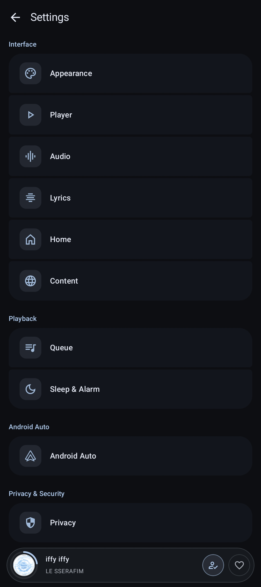
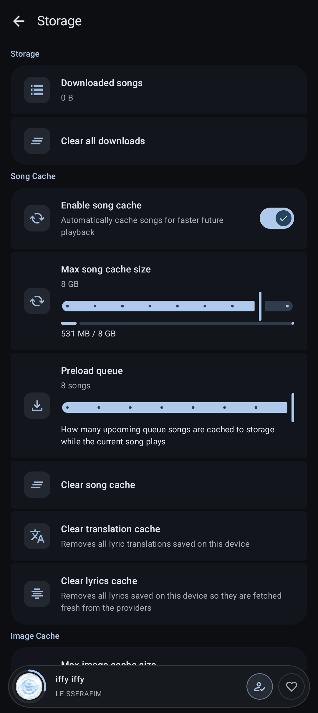
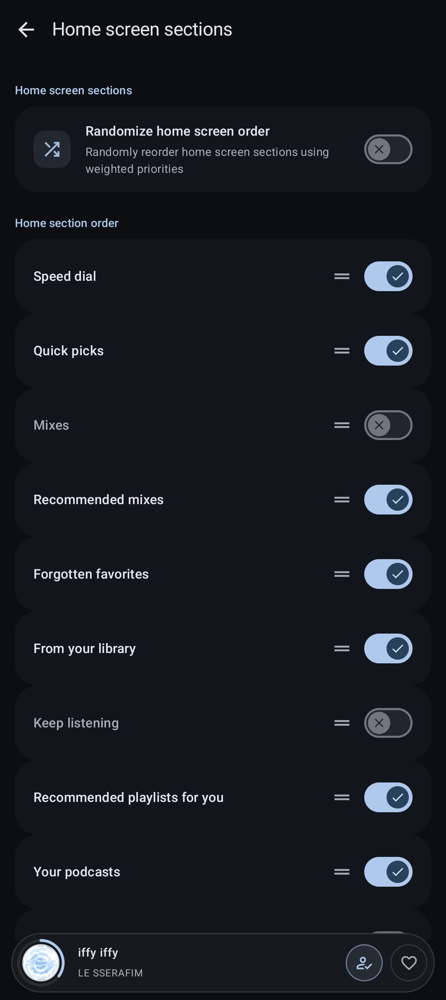
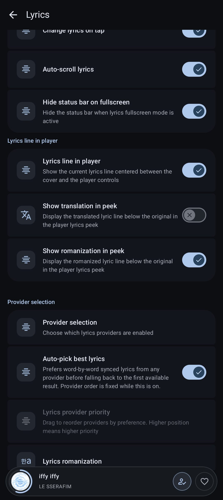
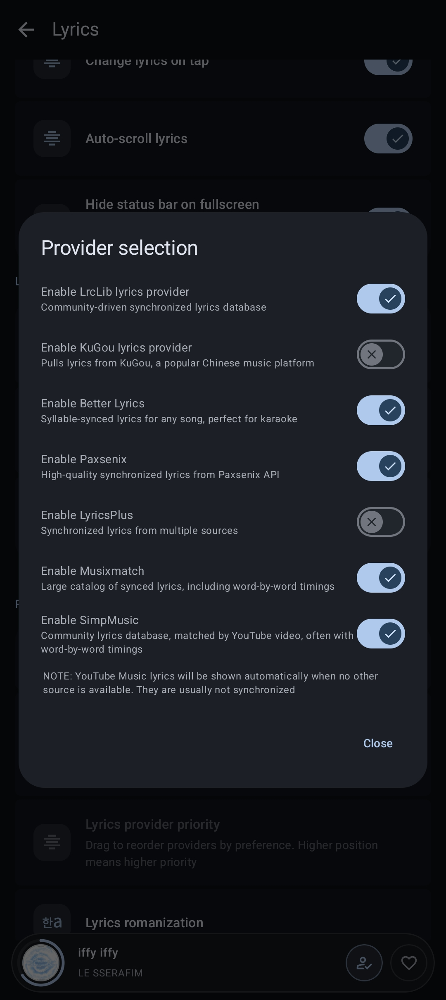
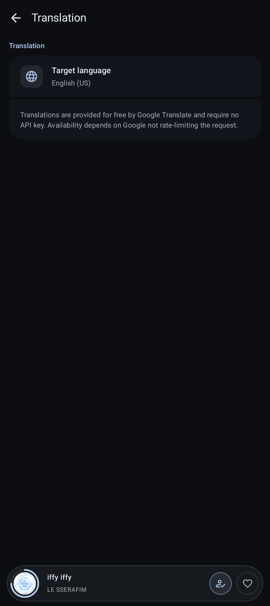
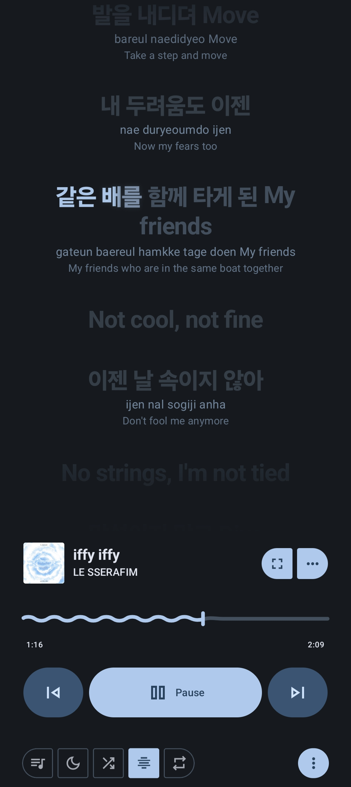
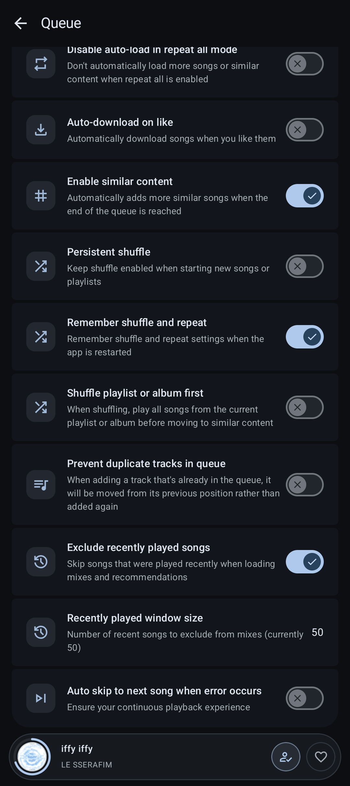

<div align="center">


# PeekMusic

### A YouTube Music client for Android that only keeps what you actually use — a fork of [Metrolist](https://github.com/MetrolistGroup/Metrolist)

</div>

PeekMusic is a personal fork of [Metrolist](https://github.com/MetrolistGroup/Metrolist),
a third-party YouTube Music client. The idea is simple: **less noise, more convenience.**
Everything that gets in the way — features nobody asked for, clutter in the settings,
janky animations — gets removed or reworked. Everything you touch every day — the home
screen, lyrics, the player — gets extra polish.

## What's different (and why it's better)

**The "Peek" Feature**: The currently active lyric line lives directly between the cover and the title in the player, no more flipping to the lyrics page just to see what's being sung.

**✨ First-Launch Onboarding**
- **7-Step Introduction**: A comprehensive first-launch onboarding flow with live previews for theme, player design, lyrics peek, playback, smart queue/caching, content filters, and update checks.

**🎵 Player & Lyrics**
- **Advanced Peek Lyrics**: The Peek feature supports offset adjustments, translations, and romanization!
- **Layout Adaptability**: The player stays open through display changes (folding, unfolding, rotating). In landscape, the peek line and controls sit as one unit; on wide portrait screens, the peek lives in the right-hand column.
- **Apple-Style Karaoke**: The lyrics peek and background adlib lines feature a smooth flowing gradient with a fading glow — just like Apple Music's karaoke mode.
- **Adlibs in the Peek**: Background vocal lines (adlibs) show up directly in the lyrics peek, alternating with the main lyric line.
- **Translation Toggle**: A translate button sits right in the player — one tap to see the translation, another to dismiss it, with inline loading progress.
- **Karaoke & Translations**: Word-by-word karaoke animations when timings are available. Added a keyless Google Translate backend for free full-song lyrics translation in a single tap!
- **Robust Romanization**: Correct language detection for Japanese romanization, and identical romanization/translation lines are intelligently merged to prevent duplication.

**📱 Widgets & Playlists**
- **Unified Playlist Controls**: The Shuffle button has been moved out of submenus and placed consistently between the Play and Menu buttons across all playlist and album views.
- **Widget Upgrades**: Replaced the "Like" button with Previous/Next track buttons on both the 4x2 and 4x3 player widgets for quicker, more useful playback control.

**🏠 Home Screen & Search**
- **Always-on Speed Dial**: The speed-dial grid is now always visible, even when logged in.
- **Clean Feed**: The Home screen strictly focuses on YouTube content.
- **Category Management**: Home sections are grouped into 19 categories with drag-and-drop reordering, and the ability to hide/restore entire categories.
- **Snappy Reloads**: Pull-to-refresh loads the full feed (continuation pages) instantly behind a short shimmer, preventing sections from popping in one by one.
- **Smarter Search**: Search autocomplete shows at most 4 suggestions before jumping straight to music results.

**🔀 Queue & Android Auto**
- **Exclude Recently Played**: A new option to prevent recently played songs from appearing in generated mixes and radios (configurable window of 1–100 tracks).
- **Android Auto Choice**: Choose your recommendations source — your YouTube home feed or local suggestions. Selecting a song under "Songs" now seeds an automatic Mix.

**🚫 Block Artists**
- **Full Control**: Block any artist directly from the artist page or the player menu. Blocked tracks are automatically filtered from queues, mixes, and radios — no more skipping. Manage your blocklist in Settings → Blocked Artists.

**⚙️ Settings & Performance**
- **Restructured Settings**: The overloaded settings pages were split into focused categories: Player, Audio, Queue, Sleep & Alarm, Lyrics, and Home.
- **Audio Quality Dialog**: Audio quality selection now uses an easy-to-use dropdown dialog in Onboarding and Settings.
- **Smart Caching**: Pre-caching settings visibility now toggles based on the main cache state.

## Screenshots

<div align="center">

<table>
  <tr>
    <td></td>
    <td></td>
    <td></td>
    <td></td>
  </tr>
  <tr>
    <td></td>
    <td></td>
    <td></td>
    <td></td>
  </tr>
</table>

</div>

## What's been removed

Things this fork deliberately doesn't carry:

- **Discord and Last.fm integrations** — and their settings pages.
- **YouTube channel switching** — one account at a time; sign out and back in to change.
- **AI lyric translation behind API keys** — replaced by the free keyless translation above.
- **Zemer and YouTube Subtitle lyrics providers** — replaced by SimpMusic and Musixmatch.

## 🌐 Help Translate PeekMusic

PeekMusic is continuously being translated by our awesome community. You can help translate the app into your native language!

We manage our translations via Crowdin. Join our project and start translating:
**[Contribute to PeekMusic on Crowdin](https://crowdin.com/project/peekmusic)**

*(If your language isn't listed, request it directly on Crowdin!)*

## Build

Debug build (for development):

```bash
./gradlew :app:assembleFossDebug
```

Release build (optimized, installable next to the debug build):

```bash
STORE_PASSWORD=<store password> KEY_ALIAS=<key alias> KEY_PASSWORD=<key password> \
  ./gradlew :app:assembleFossRelease
```

The release signing config expects a keystore at `app/keystore/release.keystore`
(`*.keystore` is gitignored). Without the environment variables, the build produces
an unsigned APK as usual.

## Credits & License

- Based on [Metrolist](https://github.com/MetrolistGroup/Metrolist) by
  [MetrolistGroup](https://github.com/MetrolistGroup) — all credit for the app goes
  to them and the upstream contributors.
- Licensed under [GPL-3.0](LICENSE), same as upstream.

## Disclaimer

This project is not affiliated with YouTube or Google. If YouTube Music is
unavailable in your region, the app will not work without a VPN or proxy connecting
to a supported region.
